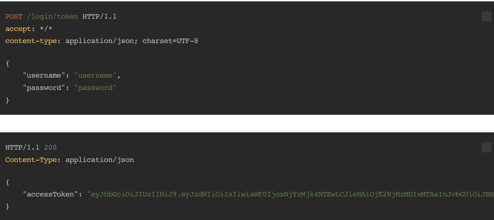
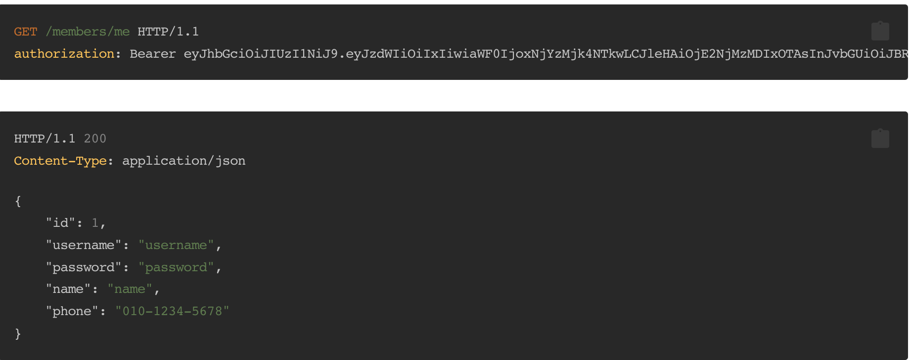
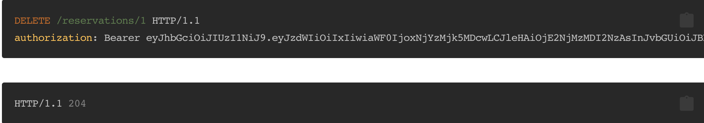

# 방탈출 예약 인증 서비스

### 기능 요구사항

* 토큰 발급하는 API 생성
* 내 정보 조회하기
* 토큰을 이용하여 본인 정보 응답하기

**프로그래밍 요구사항**

* 인증 로직은 Controller에서 구현하기 보다는 재사용이 용이하도록 분리하여 구현하다.
  * 가능하면 Controller와 인증 로직을 분리한다.
* 토큰을 이용한 인증 프로세스에 대해 이해가 어려운 경우 페어와 함께 추가학습을 진행한다.

**기능 요구사항**
* 예약하기, 예약취소 개선
  * 아래의 API 설계에 맞춰 API 스펙을 변경한다.
  * 비로그인 사용자는 예약이 불가능하다.
  * 자신의 예약이 아닌 경우 예약 취소가 불가능하다.

### 기능 설명
* `data.sql`에 Theme, Member, Schedule에 대한 쿼리가 포함되어 있음

**토큰 발급** 을 이용하여 유저의 토큰 생성
  

**내 정보 조회** - 유저 정보로 발급받은 토큰을 이용하여 조회

**예약 생성** - 발급받은 토큰과 생성되어 있는 ScheduleId를 이용하여 예약 생성

**예약 삭제** - 생성되어 있는 예약을 삭제

### TestCase
* 토큰을 이용하여 유저 정보를 가져올 수 있다.
* 예약을 생성할 수 있다.
* 예약을 조회할 수 있다
* 예약을 삭제할 수 있다
* 중복 예약을 생성할 경우, 에러가 발생한다
* 예약이 없을 때 예약 목록은 비어있다.
* 없는 예약을 삭제할 경우, 에러가 발생한다